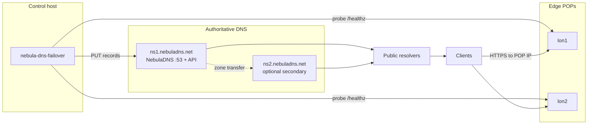
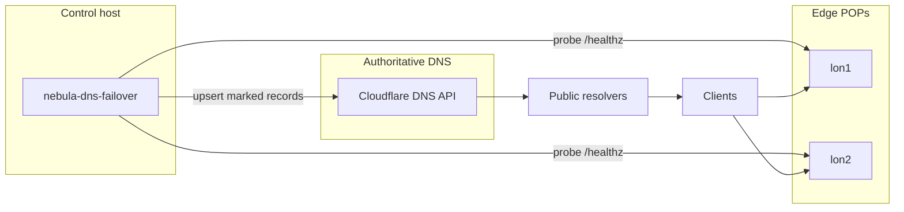
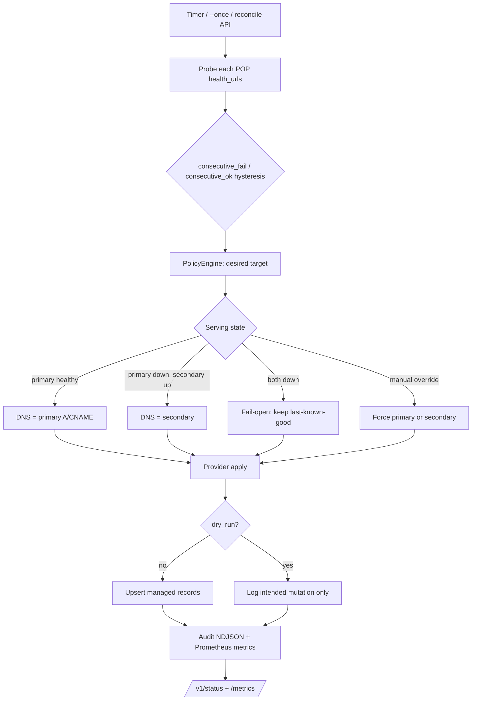
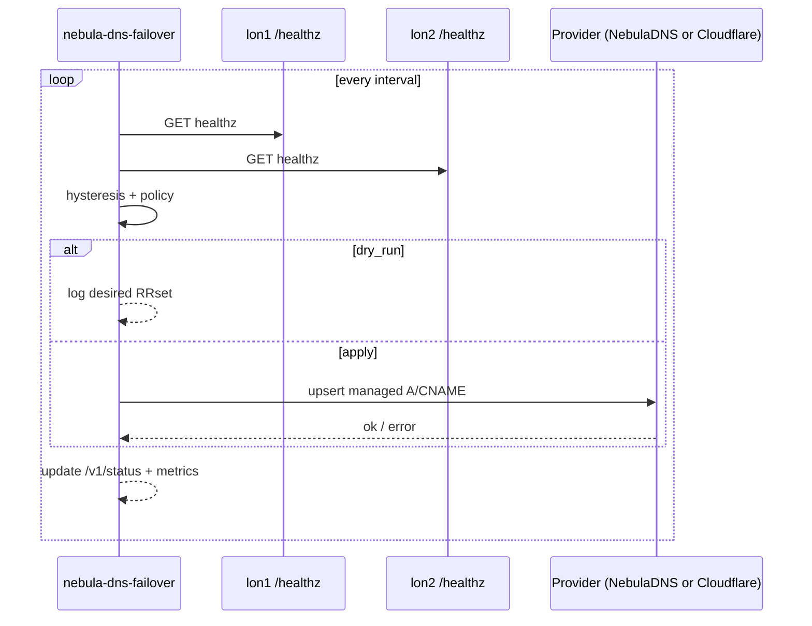

# nebula-dns-failover

Health-aware **DNS-only** failover controller. It probes edge POP `/healthz`
endpoints and rewrites **managed** DNS records so a hostname moves from primary
(lon1) to secondary (lon2) when the primary stays down — then fails back when
healthy again.

It does **not** terminate HTTP or sit in the authoritative query path. Clients
learn the new IP only after **TTL + recursive cache** expire (roughly
`2–3 × TTL`; TTL 30s → ~60–90s).

Pilot hostname: `abtesting.fictionally.org`  
Primary: lon1 `195.20.255.201` · Secondary: lon2 `85.190.106.189`

Operator runbook: [`docs/runbooks/DnsFailover.md`](../../docs/runbooks/DnsFailover.md)

---

## System architecture

You pick **one** DNS writer. NebulaDNS and Cloudflare are **alternate providers**,
not both in the write path at once.

| Piece | Role |
|-------|------|
| `nebula-dns-failover` | Health + policy only. Does **not** serve DNS or terminate HTTPS. Run on a **control host** (not only on the POP under test). |
| `lon1` / `lon2` | Edge **traffic** POPs. Probed via `/healthz`. Their `public_ipv4` values become the hostname’s A targets. |
| NebulaDNS **or** Cloudflare | Authoritative place that **owns the zone records**. The controller upserts A/CNAME there. |
| Resolvers / clients | Learn the new POP IP after TTL + cache; then connect to lon1 or lon2. |

### Nameservers (`ns1` / `ns2`) vs edge POPs (`lon1` / `lon2`)

These are different layers:

| Name | What it is |
|------|------------|
| `ns1.nebuladns.net` | Authoritative **NebulaDNS** host (glue A/AAAA at the parent). Listed in the zone’s **NS** set when NebulaDNS is authoritative. |
| `ns2.nebuladns.net` | Optional **secondary** NebulaDNS host in the same NS set (same zone data, often via AXFR/IXFR). Not the lon2 traffic POP. |
| `lon1` / `lon2` | Edge proxies / application edges. Failover **rewrites application hostnames** (e.g. `abtesting.fictionally.org`) to point at these IPs. |

### Mode A — `provider.type = "nebuladns"` (example config default)

Registrar NS for the zone → `ns1.nebuladns.net` (and `ns2…` if you run a secondary).  
You need a host (VM/k8s/container) running **NebulaDNS**. Token: `NEBULA_API_TOKEN`.  
**Cloudflare is not used** for failover writes.



### Mode B — `provider.type = "cloudflare"`

Registrar NS → Cloudflare’s nameservers.  
**No NebulaDNS host required** for the failover write path. Token: `CF_API_TOKEN`.  
`ns1.nebuladns.net` is not in this path unless you later migrate the zone.



Config switch:

```toml
[provider]
type = "nebuladns"    # → NebulaDNS (+ NEBULA_API_TOKEN); NS = ns1/ns2.nebuladns.net
# type = "cloudflare" # → Cloudflare (+ CF_API_TOKEN); NS = Cloudflare
```

---

## Flow





---

## Crate layout

| Module | Role |
|--------|------|
| `health` | Concurrent probes + consecutive fail/ok counters |
| `policy` | Active-passive / active-active, fail-open, failback delay, manual override |
| `provider` | `nebuladns` (fast record API) or `cloudflare` (marker-only mutations) |
| `apply` | Reconcile desired vs live; never blank RRset on both-down |
| `audit` | NDJSON mutation log |
| `api` | `/livez`, `/readyz`, `/metrics`, `/v1/status`, break-glass POSTs |
| `controller` | Daemon loop and `--once` |

---

## Quick start (local)

```bash
# from repo root
cargo build -p nebula-dns-failover --bin nebula-dns-failover

# unit tests (no live DNS / no real tokens required)
cargo test -p nebula-dns-failover

# one probe+reconcile cycle against example config (dry-run)
# No NEBULA_API_TOKEN needed — dry-run plans mutations without calling DNS APIs.
cargo run -p nebula-dns-failover -- \
  --config config/dns-failover.example.toml \
  --once --dry-run
echo $?   # 0 ok · 2 config/auth · 3 apply failed · 4 both POPs down (fail-open)
```

Daemon (still dry-run with the example config):

```bash
cargo run -p nebula-dns-failover -- \
  --config config/dns-failover.example.toml

# another terminal
curl -s localhost:9119/livez
curl -s localhost:9119/v1/status | jq .
curl -s localhost:9119/metrics | grep nebula_dns_failover
```

Deploy artifacts: `deploy/dns-failover/` (systemd unit, compose, config example).

---

## How to test it yourself

### 1. Offline / CI-safe (always)

```bash
cd /Users/balinderwalia/projects/nebuladns   # or your clone
git checkout feat/dns-failover              # or main after merge
cargo test -p nebula-dns-failover
cargo clippy -p nebula-dns-failover --all-targets -- -D warnings
```

These cover hysteresis, policy transitions, and fail-open without talking to POPs or DNS.

### 2. Dry-run against live POP health (no DNS writes)

Uses the example TOML (`dry_run = true` or force `--dry-run`):

```bash
cargo run -p nebula-dns-failover -- \
  --config config/dns-failover.example.toml \
  --once --dry-run
```

Expect JSON logs of probes + a desired target. Exit `0` if reconcile succeeded in dry-run; `4` if both POPs look down (fail-open path).

### 3. Daemon + status API

```bash
cargo run -p nebula-dns-failover -- --config config/dns-failover.example.toml
# wait a few seconds
curl -s localhost:9119/v1/status | jq .
```

Check `pops[].up`, hostname `state` (`primary` / `secondary` / `degraded_both_down`), and `dry_run: true`.

### 4. Live apply (staging only)

1. Copy `config/dns-failover.example.toml` → a private config; set `dry_run = false`.
2. Prefer a **test** hostname first (`abtesting-failover-test.fictionally.org`), not production.
3. Export tokens:
   - NebulaDNS provider: `NEBULA_API_TOKEN`
   - Cloudflare provider: `CF_API_TOKEN` (zone DNS edit, least privilege)
   - Break-glass API: `FAILOVER_API_TOKEN`
4. Run `--once` without `--dry-run`, then:

```bash
dig +short abtesting-failover-test.fictionally.org @1.1.1.1
curl -s -H "Authorization: Bearer $FAILOVER_API_TOKEN" \
  -X POST localhost:9119/v1/hostnames/abtesting-failover-test.fictionally.org/failover
```

5. Follow the cutover checklist in [`docs/runbooks/DnsFailover.md`](../../docs/runbooks/DnsFailover.md).

### 5. Anti-flap / chaos (optional)

- Lower `interval`, raise `consecutive_fail` / `consecutive_ok`, or set `failback_delay`.
- Block lon1 health URL briefly; watch state flip to `secondary` only after N failures.
- Restore lon1; confirm failback only after M successes (+ delay).

---

## Config & secrets

| Item | Purpose |
|------|---------|
| `config/dns-failover.example.toml` | Hostnames, POPs, provider, hysteresis |
| `NEBULA_API_TOKEN` | Bearer for NebulaDNS `PUT /api/v1/zones/.../records` |
| `CF_API_TOKEN` | Cloudflare DNS edit (if `provider.type = "cloudflare"`) |
| `FAILOVER_API_TOKEN` | Bearer for break-glass `/v1/hostnames/...` |

Cloudflare writes carry comment marker  
`nebula-dns-failover | hostname=… | policy=… | v=1`. Unmarked records are never deleted.

---

## HTTP surface

| Path | Auth | Purpose |
|------|------|---------|
| `GET /livez` | none | Process up |
| `GET /readyz` | none | Ready after first cycle |
| `GET /metrics` | none | Prometheus |
| `GET /v1/status` | none | POP + hostname snapshot |
| `POST /v1/hostnames/{fqdn}/failover` | Bearer | Force secondary |
| `POST /v1/hostnames/{fqdn}/failback` | Bearer | Force primary |
| `POST /v1/hostnames/{fqdn}/reconcile` | Bearer | Run cycle now |
